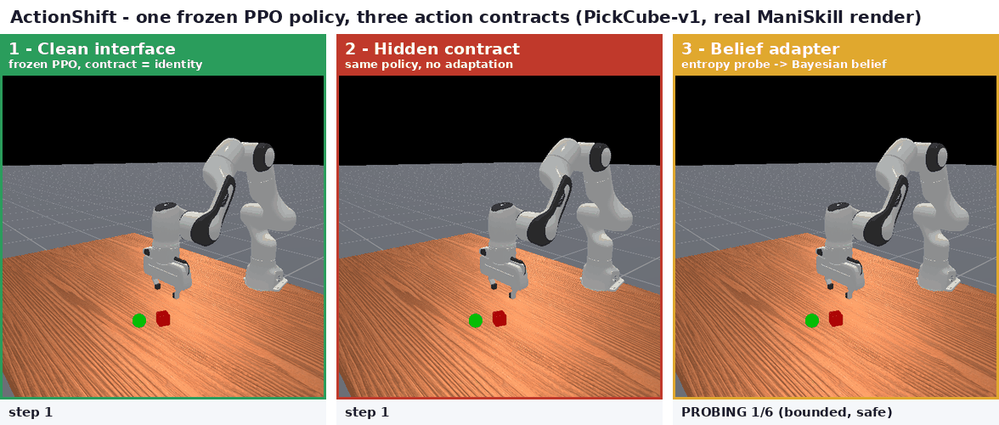
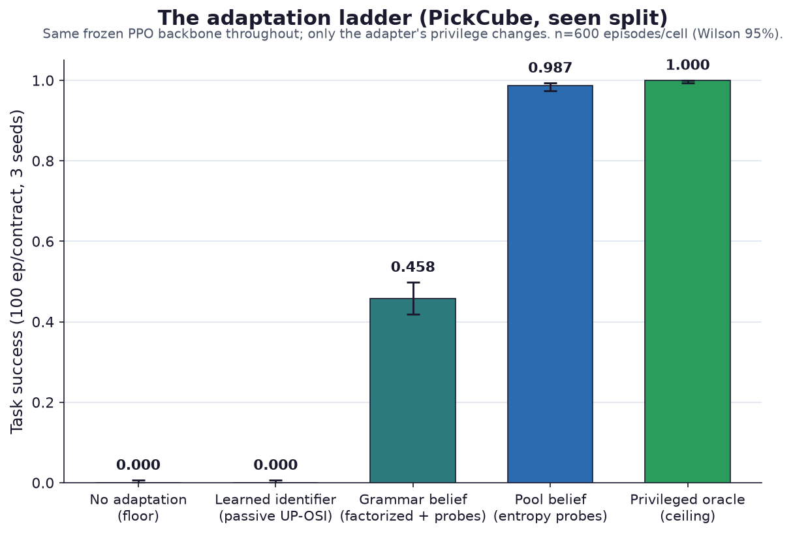
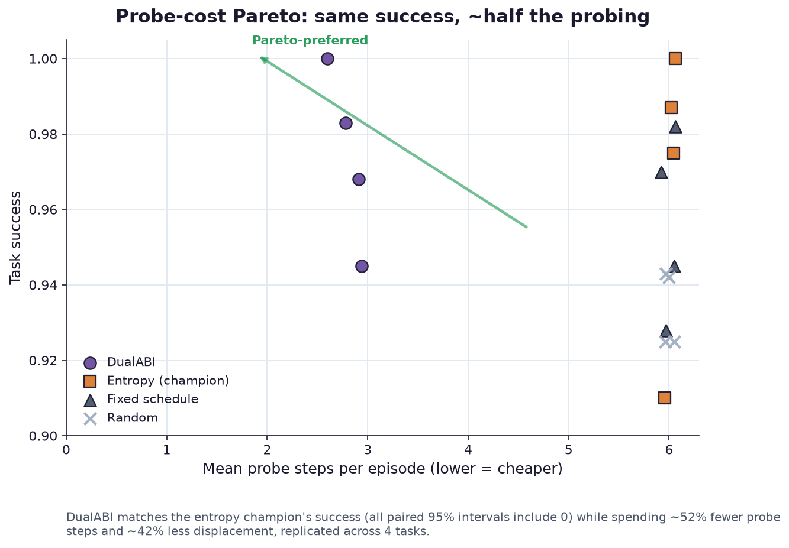
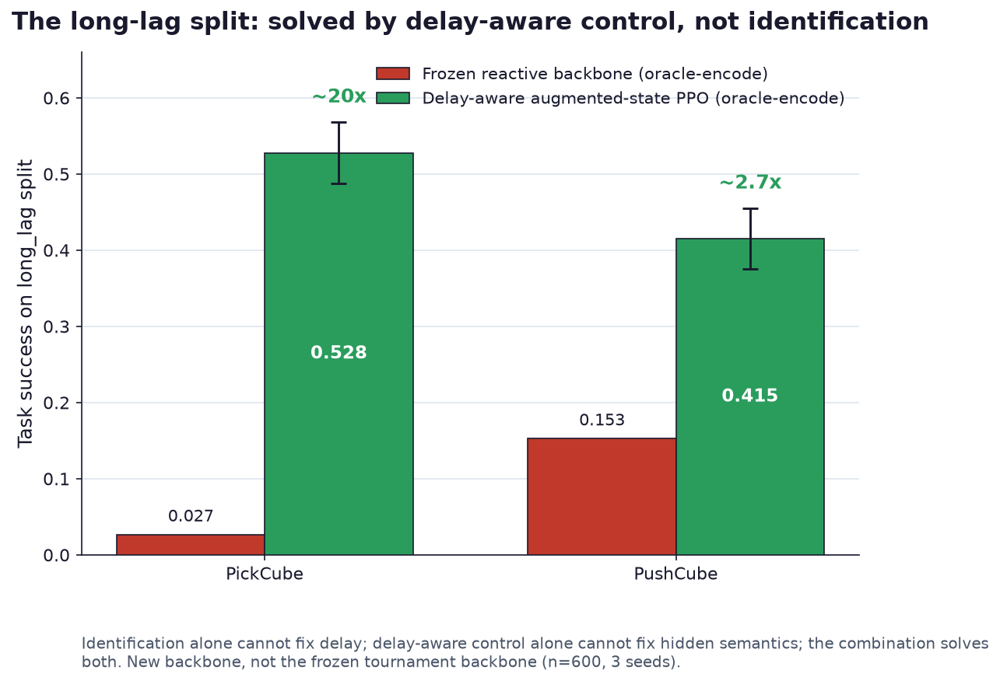
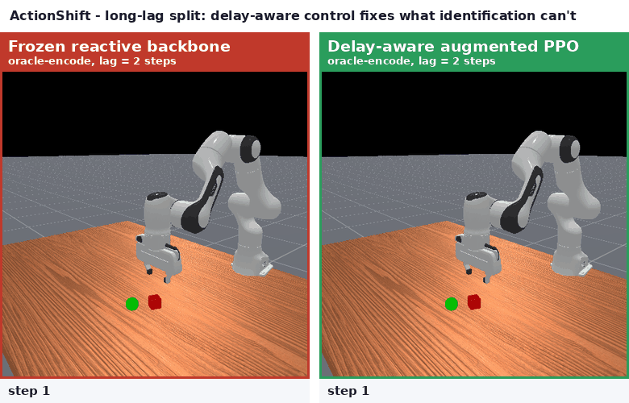

# ActionShift
[](https://github.com/Archerkattri/actionshift/releases)
[](https://doi.org/10.5281/zenodo.21500713)
[](https://huggingface.co/datasets/kattri15/actionshift)
[](https://huggingface.co/kattri15/actionshift-baselines)
[](LICENSE)
[](pyproject.toml)
[](https://github.com/haosulab/ManiSkill)
[](tests/)

> **What happens to a trained robot policy when the meaning of its action numbers silently changes —
> and can it recover on its own, without ever being told?**

ActionShift is a benchmark and research harness for manipulation policies whose **action interface
changes without exposing the active contract to the agent**. It freezes disjoint generalization splits
and measures adaptation on real ManiSkill tasks (PickCube, PushCube, PullCube, StackCube).



*One frozen PPO policy, three action contracts, real ManiSkill renders. **Left:** the clean interface —
the policy grasps the cube. **Middle:** a hidden contract (channels permuted, signs flipped, scales
changed) — the same policy acts confidently and wrongly. **Right:** the belief adapter spends 6 bounded,
safe probe steps, identifies the contract, and then succeeds — no retraining, never told which contract
is active.*

**TL;DR install** (Python 3.11): `pip install -e '.[dev]'` then `actionshift-selftest` — a simulator-free
plug-and-verify run. Full steps, plus the ManiSkill extras, in [Install and quickstart](#install-and-quickstart).

## Part of the Action-Interface pair

ActionShift is one half of a two-project attack on the **hidden action-interface contract** problem —
when the meaning of a robot's action numbers is undocumented or silently changed. Its sibling,
[**ActionABI**](https://github.com/Archerkattri/actionabi), is the *offline forensic* half: it recovers
an action-interface contract from logged trajectories after the fact and abstains when the evidence is
insufficient. ActionShift is the *online adaptation* half: a benchmark that measures whether a policy can
recover the same hidden contract on its own, in the loop, from a handful of bounded probes. The two share
one **contract grammar** (permutation · sign · scale · target · frame · lag · gripper), and the coupling
is real code, not just a theme: ActionABI's C++ evidence scorer runs as a **live backend inside
ActionShift's belief loop** via a pybind11 fusion module, with verified numerical parity (see
[`reports/cpp_fusion.md`](reports/cpp_fusion.md)). Forensic recovery ↔ online adaptation, one shared
grammar, one shared scorer. → **[ActionShift](https://github.com/Archerkattri/actionshift)** ·
**[ActionABI](https://github.com/Archerkattri/actionabi)**

## Contents

- [What is this?](#what-is-this)
- [Who is this for?](#who-is-this-for)
- [How it works](#how-it-works)
- [How it performed (honesty-first)](#how-it-performed-honesty-first)
- [Install and quickstart](#install-and-quickstart)
- [`actionshift-selftest` — plug-and-verify](#actionshift-selftest--plug-and-verify)
- [Claims (graded SOTA ledger)](#claims-graded-sota-ledger)
- [Claim audit (adversarial red-team)](#claim-audit-adversarial-red-team)
- [Benchmark card (week-one falsification gate)](#benchmark-card-week-one-falsification-gate)
- [Reproducing](#reproducing)
- [Experiment index](#experiment-index)
- [Report index](#report-index-reports)
- [Related work & positioning](#related-work--positioning)
- [Claim boundary and limits](#claim-boundary-and-limits)
- [License and citation](#license-and-citation)

## What is this?

A learned manipulation policy emits a vector of numbers every control step. Whoever wired the robot
decided what those numbers *mean*: which command channel drives which joint, with what sign, what gain,
whether the value is a delta or an absolute target, in which reference frame, with what actuation delay,
and which way the gripper opens. That mapping — the **action contract** — is usually undocumented, and
it silently varies across robot stacks, datasets, and firmware. When a policy is deployed against a
contract different from the one it learned, it does not error out: it acts confidently and wrongly, and
success collapses to near zero.

ActionShift makes that hidden contract the explicit object of study. A software ABI re-maps the numbers a
policy emits into controller behavior — composing permutation, sign, scale, target convention, reference
frame, latency, and gripper semantics — and the benchmark measures **how well a policy adapts when it is
never told which contract is active.** It holds the task dynamics fixed and varies only the interface, so
any drop in success is attributable to the contract and nothing else.

DualABI is the included experimental controller. It maintains a structured belief over the action
contract, conditions a task policy on that belief, proposes bounded candidate actions, rejects unsafe
candidates with a hard mask, and scores survivors by task value, safety risk, and expected reduction in
task regret. Entropy-seeking, no-information, no-safety, and exact-belief variants are explicit ablations
rather than hidden switches.

## Who is this for?

- **Robot-learning researchers** studying adaptation, system identification, sim-to-real transfer, or
  robustness — ActionShift gives frozen, hash-addressed splits, privileged oracles, preregistered
  promotion gates, and a matched-privilege method ladder over real ManiSkill backbones, so an adaptation
  method can be measured against an honest ceiling and floor rather than a hand-picked baseline.
- **Dataset and robot-stack maintainers** who need to know whether two robots that share a policy
  actually share an action contract — the companion [`actionshift-selftest`](#actionshift-selftest--plug-and-verify)
  packages the core finding as a bounded startup check: *is this robot wired the way the policy thinks?*
- **Anyone deploying policies across robot stacks**, where a swapped connector, a flipped driver sign, a
  changed controller mode, or an added latency turns a competent policy into a confidently-wrong one.

The scientific companion project [ActionABI](https://github.com/Archerkattri/actionabi) attacks the same problem from the
data side: it forensically recovers an undocumented action contract from *logged trajectories alone*,
with calibrated abstention. Its C++ scoring core is [load-bearing inside ActionShift's belief loop](#related-work--positioning).

## How it works

**Contract grammar.** A contract composes seven field families over the action vector:

| Field | Meaning |
|---|---|
| permutation | which policy channel drives which controller channel |
| sign | per-channel direction flip |
| scale | per-channel gain (grid-valued in the declared grammar) |
| target | delta vs absolute target convention |
| frame | reference frame (base vs tool) |
| lag | execution delay in control steps |
| gripper | open/close convention and sign |

**The mechanism (policy-agnostic adaptation).** Every method is an *adapter* that sits between a frozen
task backbone and the hidden-contract environment: the backbone emits a canonical command, the adapter
turns it into the raw action the hidden wrapper executes, and the adapter learns from the calibrated
response. Because adapters consume canonical actions, the same adapter rescues a frozen PPO policy and a
frozen Diffusion Policy unchanged. Belief-family adapters spend a short, bounded, safe **probe phase** —
a handful of amplitude-capped pulses (the gripper is never actuated) folded into an exact Bayesian belief
over the declared contract pool — then act on the maximum-a-posteriori contract.


**Splits.** Five frozen, hash-addressed splits (`configs/split/`): `seen`, `unseen_value`,
`unseen_composition` (zero contract- and composition-signature overlap with training), `long_lag`, and
`task_transfer`. Materialized manifests make the disjointness test-enforced and reproducible.

**Tasks.** Four competence-gated ManiSkill tasks — PickCube-v1, PushCube-v1, PullCube-v1,
StackCube-v1. PegInsertionSide-v1 is honestly **excluded** on backbone competence (0/100 at the full
official 75M-step budget; see `reports/peg_retry.md`).

**Method families.**

- **Privileged oracle** — knows the true contract; the instantaneous ceiling.
- **Pool-privileged belief** (exact belief, fixed/entropy/random probes, DualABI) — shares a declared
  finite contract pool; adapts within an episode.
- **Grammar-knowledge belief** (full-grammar factorized belief, hold-probe excitation, scale corrector)
  — knows only the declared grammar, no pool.
- **Unprivileged learned identifiers** (passive UP-OSI-style, recurrent episode-length, probe-augmented)
  — no pool, no grammar enumeration; learn to identify from responses.
- **Delay-aware augmented-state control** (PPO/SAC) — solves the long-lag split by planning through
  delay rather than identifying the contract.
- **No adaptation** — sends policy output through the hidden contract unchanged; the floor.

## How it performed (honesty-first)

Exact numbers and intervals are in `reports/adaptation_tournament.md` (rounds 1–13); the plots below quote
those reports directly, and the honesty caveats travel with each headline. **No claim of broad novelty or
method superiority is made** — the supported niche is the hidden-ABI compositional benchmark and its
matched-privilege adaptation ladder. See the [claim boundary](#claim-boundary-and-limits) and the graded
[Claims ledger](#claims-graded-sota-ledger).

**The adaptation ladder — privilege buys success.** On PickCube/seen, the same frozen PPO backbone goes
from a hard **0.000** floor (no adaptation, and the unprivileged passive learned identifier) up through a
grammar-only factorized belief (**0.458**) to a pool-privileged belief (**0.987**) that reaches the
privileged oracle ceiling (**1.000**). The gap between the learned identifiers and the belief family is
the load-bearing negative result: *active probing is not a substitute for hypothesis-space knowledge.*



**DualABI wins on probe efficiency, not raw success.** It matches the entropy champion on success on
every instantaneous cell while using **~52% fewer probe steps (mean 2.89 vs 6.00)** and **~42% less probe
displacement** — a Pareto win that replicates across four tasks. It does **not** beat entropy on raw
success anywhere (all paired 95% intervals include zero), and the week-one proxy negative (DualABI < fixed
pulses) stands on record. (Rounds 1, 2)



**The long-lag split is solvable by composition, not identification.** A delay-aware augmented-state PPO
backbone lifts Pick/long-lag from a frozen-oracle 0.027 to **0.528 [0.488, 0.568]** (≈20×) and Push from
0.153 to **0.415 [0.376, 0.455]** (≈2.7×) — identification alone cannot fix delay, delay-aware control
alone cannot fix hidden semantics, the combination solves both. This is a **new backbone**, not the frozen
tournament backbone; report **both** ratios, not just Pick. (Round 4)





**Brittleness is a property of the interface, not the learning paradigm.** A competent frozen Diffusion
Policy collapses from ~0.58 to ~0.003 under the same hidden contracts that zero PPO — the same
0.000–0.007 floor — and the same policy-agnostic belief adapters restore both to their oracle ceilings.
The failure is interface-semantic, not policy-class-specific. (Round 12)


**Other load-bearing findings (all in `reports/`).**

- **Information-seeking helps, within a matched-privilege comparison.** Entropy-guided probing beats fixed
  probing by **+5.8 points [+3.7, +8.2] on Pick/seen** (paired 95% bootstrap, 3 seeds, 600 paired
  episodes) — clearing the preregistered 5-point promotion gate with no safety/cost regression — and
  replicates on a second task. It does **not** generalize to all tasks: entropy is the *worst*
  belief-family method on StackCube/seen. (Rounds 1, 5)
- **Negative results are load-bearing.** Passive learned system-ID collapses to ~0.0 end-to-end under the
  weak real response model; recurrent accumulation lifts discrete fields but continuous map estimation
  plateaus at chance; probe-augmented learning caps permutation at 0.39. (Rounds 1, 2, 6)
- **The absolute-mode wall is breached.** Hold-probe excitation takes dead all-absolute cells from 0.005
  to **0.722 [0.684, 0.756]** (Push) and 0.000 to **0.790 [0.756, 0.821]** (Pick), with exact permutation
  recovery and causal controls. (Round 11)
- **External anchors are honest.** The augmented-state recipe is delay-robust and baseline-tier on DCAC's
  own MuJoCo delay benchmark (PPO and SAC), but makes **no absolute-return claim** vs DC/AC.
  (Rounds 10, 13)

## Install and quickstart

Python 3.11 and PyTorch 2.4+ are required. ManiSkill is optional for unit tests but required for the
real simulator smokes.

```bash
python -m venv .venv
.venv/bin/pip install -e '.[dev,maniskill]'

# static gates
.venv/bin/ruff check src tests experiments
.venv/bin/mypy src
.venv/bin/pytest -q

# validate a frozen split and materialize the evaluation matrix (one example slice)
.venv/bin/actionshift-validate split configs/split/unseen_composition.yaml
.venv/bin/actionshift-evaluate matrix experiments/manifests/headline.jsonl

# plug-and-verify self-test: "is this robot wired the way the policy thinks?"
.venv/bin/actionshift-selftest --demo swapped-axes --json

# real ManiSkill integration smoke (requires the maniskill extra)
.venv/bin/actionshift-smoke --sim-backend cpu --output reports/maniskill_cpu_smoke.json

# regenerate the README media (real renders + report-derived plots)
CUDA_VISIBLE_DEVICES=0 .venv/bin/python media/make_media.py all   # hero + lag GIFs + selftest panel
.venv/bin/python media/make_plots.py                              # the report-number plots + diagram
```

Console entry points: `actionshift-validate`, `actionshift-evaluate`, `actionshift-smoke`,
`actionshift-sprint`, `actionshift-selftest`.

## `actionshift-selftest` — plug-and-verify

**Is this robot wired the way the policy thinks?**

A learned policy assumes a particular *action contract*: which command channel drives which joint, with
what sign, scale, and timing. If the robot is wired differently — two axes swapped on a connector, a
sign flipped in a driver, a controller lagging — the policy will act confidently and wrongly.
`actionshift-selftest` is a bounded startup check that catches that mismatch **before** you hand control
to the policy. It packages the pair's core finding (a short probe phase identifies a hidden action
contract; see `reports/adaptation_tournament.md`) as a practical self-test with a fail-closed verdict
and a meaningful exit code.


### 30-second quickstart

```bash
pip install -e .          # registers the console script

# Demo: prove the tool CATCHES a miswiring (no robot, no GPU needed)
actionshift-selftest --demo miswired
#  -> VERDICT: MISMATCH (exit 1): channels 0 and 1 SWAPPED; channel 3 sign FLIPPED

actionshift-selftest --demo identity        # -> PASS (exit 0)
actionshift-selftest --demo unmodeled       # -> INCONCLUSIVE (exit 2)  (abstains, never guesses)

# Real ManiSkill task (auto-runs response calibration if missing):
actionshift-selftest --real --task pick_cube --expected identity
```

Exit codes are scriptable: **0 = PASS, 1 = MISMATCH, 2 = INCONCLUSIVE**.

### What it does

1. **Probe phase (bounded, safe).** Sends `--budget` (default 6) bounded raw pulses
   (`|action| <= --amplitude`, default 0.5; the gripper is never actuated) and folds each observed
   response into an exact Bayesian belief over a declared pool of plausible wirings. Two probe
   schedules: `--strategy entropy` (default; picks the most informative pulse) or `fixed` (cycles the
   pose channels).
2. **Identify.** Reports the maximum-a-posteriori wiring with **per-field confidence** (the marginal
   posterior mass on each field's value).
3. **Verdict** against the wiring the policy `--expected`s (default: identity):
   - **PASS** — every observable field is resolved with high confidence *and* matches expected.
   - **MISMATCH** — a field is confidently resolved *and* differs; the exact diff is printed (e.g.
     `channels 0 and 1 SWAPPED; channel 3 sign FLIPPED`).
   - **INCONCLUSIVE** — the belief did not concentrate, or the best hypothesis fits the responses
     poorly (the true wiring is likely outside the declared pool). The tool **abstains rather than
     guesses**.
4. **Probe-safety statement** — prints the amplitude bound and an estimated end-effector displacement
   incurred during probing.

### What it checks

Within its declared pool of wirings, the tool resolves and verifies these observable fields:

| Field | Example miswiring caught |
|---|---|
| `permutation` | two command channels swapped |
| `sign` | a channel's direction flipped |
| `scale` | a channel's gain wrong (under delta control) |
| `target` | delta vs. absolute command encoding |
| `frame` | base vs. tool frame (under a non-identity rotation) |
| `lag` | actuation delay of N control steps |

### What it CANNOT check (honest limits)

These are structural limits of a bounded pose probe, not tuning knobs. They come straight from the
pair's measured results (`reports/adaptation_tournament.md`, the [Claims](#claims-graded-sota-ledger)
section) and the tool is built to **abstain, never bluff**, on them:

- **Gripper direction (`gripper_inverted`) — out of scope, always "not checked."** The probe never
  actuates the gripper (a safety choice), so a pose probe carries no evidence about gripper polarity.
  Verifying it needs a gripper channel *and* a gripper probe (a v2 calibration extension).
- **Exact scale under *absolute*-target control.** Scale is non-identifiable under the weak
  `pd_ee_delta_pose` response with absolute-target encoding (the pair's single open challenge); scale
  confidence stays low and the verdict abstains.
- **Lag *correction*.** The tool *identifies* lag but does not correct for it — that requires a
  delay-aware backbone (`reports/adaptation_delay_aware.md`), not a probe.
- **Tool frame under identity rotation.** With an identity end-effector rotation (the default), base
  and tool frames are indistinguishable; the default pool is therefore base-frame only.
- **Wirings outside the declared pool.** A wiring it never modeled triggers the misspecification guard
  (`INCONCLUSIVE`) — it is **not** silently mapped onto the nearest pool member as a false verdict.
- **Real-robot short-window limit.** On the real sim, the weak controller response means a 6-step probe
  usually **abstains** (fail-closed) rather than concentrating; raise `--budget` for real hardware.
  Synthetic/demo mode uses the calibrated response model directly, so the minimal 6-step budget suffices.

### Options

```
--task            ManiSkill task key (default: pick_cube)
--demo NAME       inject a named demo wiring as the hidden contract (synthetic):
                  identity, swapped-axes, sign-flip, miswired, scaled, reversed, lagged, unmodeled
--hidden-contract inject an arbitrary hidden contract (library name | JSON | path)
--expected        the wiring the policy expects (library name | JSON | path; default: identity)
--strategy        fixed | entropy   (default: entropy)
--budget          probe steps (default: 6)
--amplitude       probe amplitude bound (default: 0.5)
--num-envs        parallel probe environments (default: 8)
--confidence-floor  min per-field posterior to trust a field (default: 0.9)
--misspec-ratio     max fit residual before abstaining (default: 4.0)
--real            probe a real ManiSkill environment (auto-calibrates if missing)
--json            emit machine-readable JSON
```

## Claims (graded SOTA ledger)

Sim-only, no hardware. Every claim follows the project's "we are not aware of X" convention — no "first"
claims. Grading is deliberately harsh: a claim a hostile reviewer could destroy with one counter-example
from the project's own reports is downgraded to STRETCH or cut. Sources: the `reports/*.md` files, the
[Related work](#related-work--positioning) section, and a websearch pass on the ManiSkill3 official PPO
baseline configs.

### Claim 1. DualABI is a probe-efficiency Pareto win over the tournament's best prober — **STRONG**

**Claim:** On the matched-privilege belief-family tournament, DualABI (task-regret-aware probe selection
with early stopping) matches the top prober's success rate while spending roughly half the probe budget
and displacement, replicating across every task tested.

**Evidence:** Pick/seen: DualABI 0.983 vs entropy_probes 0.987 (Δ −0.003 [−0.017,+0.010] ns) at 2.78 vs
6.00 probe steps; Push/seen 1.000 vs 1.000 at 2.60 vs 6.00 steps; over 4 instantaneous cells (Pick/Push
× seen/unseen), mean probe steps 2.89 vs 6.00 (−52%), mean displacement −42%, mean success tied (0.990
vs 0.987) — `reports/adaptation_dualabi.md`. Replicates on PullCube (2.5–2.9 vs 6.0 steps) —
`reports/third_task.md` — and StackCube (2.9/3.5 vs 6.0 steps) — `reports/fourth_task.md`. 4 of 4
competent tasks.

**External comparator:** No comparable published "N probes out of a budget → identification accuracy"
curve exists after checking ASID (qualitative "one rollout suffices" only) and Dynamics-as-Prompts
(accuracy gains, no steps-budget curve). **Verified empty niche**, not a beat: state as "no external
number exists to compare against."

**Caveats:** Matched-privilege only (every belief-family method shares the same declared 9-contract pool,
budget, amplitude, backbone, seed) — a within-family efficiency result, not an unprivileged-adaptation
claim. Does **not** beat entropy on raw success anywhere (all paired 95% intervals include zero). The
threshold was calibrated on a 48-episode pilot then frozen (robust over τ ∈ [0.4, 1.5]). Long-lag was
evaluated later (Study B, `reports/lag_completions.md`) and DualABI collapses under lag on the frozen
backbone like the rest of the belief family (0.02/0.11) — do not extend the Pareto claim to lag. Sim-only,
`pd_ee_delta_pose`, identity-rotation-wrapper unless stated otherwise.

### Claim 2. Entropy-guided active probing beats fixed probing on identification quality — **MODERATE**

**Claim:** Under matched privilege, entropy-guided probe selection clears the preregistered
5-percentage-point promotion margin over fixed scripted probing on some but not all tasks, with no
safety-cost regression where it clears.

**Evidence:** Pick/seen +5.8 [+3.7, +8.2] (3-seed, 600 paired episodes) — the preregistered gate-clear,
`reports/adaptation_tournament.md` round 1. Replicates significantly on PullCube/unseen-composition +5.5
[+3.3, +7.8] — round 5 / `reports/third_task.md`. Direction only (below the 5-point margin, not
significant) on Push/seen (+1.8 [+0.8,+3.0]).

**Caveats — the reason this is downgraded from STRONG:** the ordering does **not** replicate on
StackCube: entropy is the *lowest*-scoring belief-family method on seen (0.910, below fixed/passive/
DualABI at 0.945) and does not clear the promotion gate on unseen (+2.5 ns) — `reports/fourth_task.md`.
On PullCube the companion "`> random`" tail also inverts (random_probes highest, 0.997) —
`reports/third_task.md`. Honest statement: "clears the promotion gate on 2 of 4 tasks (Pick/seen,
Pull/unseen), replicates in direction on a 3rd (Push/seen), and is the *worst* belief-family method on
the 4th (Stack)" — a genuine, disclosed, task-dependent result, not a general law.

### Claim 3. The long-lag split is solvable with delay-aware training — **STRONG** (internal claim)

**Claim:** A delay-aware augmented-state PPO backbone (observation augmented with the last 4 canonical
actions, trained under randomized per-episode lag {0,1,2,4}) recovers substantial task success on the
long-lag split where the frozen reactive backbone — oracle included — collapses to near zero.

**Evidence (3-seed, 600 episodes, Wilson 95% intervals, every interval strictly above its frozen-backbone
reference):** Pick oracle-encode 0.528 [0.488,0.568] vs frozen oracle 0.027 (**≈20×**); Push oracle-encode
0.415 [0.376,0.455] vs frozen oracle 0.153 (**≈2.7×**); Pick exact-belief 0.360 vs frozen 0.022; Push
exact-belief 0.387 vs frozen 0.117. Seen-split competence: Pick 0.715, Push 0.990, both clear the 0.5
floor — `reports/adaptation_delay_aware.md`.

**Caveats:** report **both** ratios (~20× Pick, ~2.7× Push) — leading with only Pick is a cherry-pick.
This is a **new backbone**, not the frozen Gate 0/1 tournament backbone — not a like-for-like method
contest against the frozen-backbone tournament rows. Labeled "delay-aware augmented-state PPO (local)" —
the classical Katsikopoulos/Walsh state-augmentation reduction — **not** DCAC or D-TRPO. Lag 4 remains
hardest (0.27–0.40). On StackCube even the *oracle* collapses to 0.000 under lag
(`reports/fourth_task.md`) — the long-lag solution is demonstrated on Pick and Push only.

### Claim 4. Not aware of prior published randomized action-delay online RL on manipulation — **MODERATE** (empty niche, heavily hedged)

**Claim:** We are not aware of prior published work studying randomized per-episode action-delay-robust
online RL specifically on ManiSkill-style manipulation tasks.

**Evidence for the search:** 9+ distinct query phrasings. Three genuine near-misses **must** be cited,
not omitted: (1) arXiv:2509.20869 — Meta-World manipulation under random *observation* delay (not
action), benchmarks DCAC as a baseline and reports it degrading outside its trained delay range; (2)
arXiv:2506.00131 — D4RL Adroit dexterous-hand tasks under delay, but *offline* RL, not online PPO; (3)
arXiv:2605.15480 — Franka Panda under stochastic *communication* delay, a teleoperation framing, not
randomized action-lag PPO.

**Caveats:** This is an **"EMPTY-NICHE (hedged, not clean)"** verdict, not "CLAIMABLE-NOW" — a flat
"nothing exists" statement is not defensible. Use the exact hedged sentence: *"We are not aware of prior
published results on randomized per-episode action-delay-robust online RL specifically on ManiSkill-style
manipulation tasks; the closest related work studies observation delay on Meta-World... or offline-RL
delay on Adroit manipulation..., neither of which matches our action-lag/online-PPO/ManiSkill3 setting."*
Do not call these "the first strong delayed-manipulation numbers" without immediately citing all three
near-misses in the same paragraph.

### Claim 5. No prior benchmark isolates compositional action-interface shift — **STRONG**

**Claim:** We are not aware of a prior manipulation benchmark that holds task dynamics fixed and varies a
compositional, discrete action-interface contract (permutation, sign, scale, target convention, frame,
lag, gripper convention) as the object of study, with privileged oracles and preregistered promotion
gates.

**Evidence / external comparator (4 benchmarks independently checked and ruled out):**
RoboHiMan/HiMan-Bench (arXiv:2510.13149, compositionality over chained skills/subgoals, not
controller/frame), ATOM-Bench (arXiv:2606.16826, atomic-skill composition), LIBERO-Plus (arXiv:2510.13626,
7 axes — object layout/camera/pose/language/lighting/background/sensor-noise, all visual/scene), and
COLOSSEUM (arXiv:2402.08191, 14 axes, all visual/physical). Reflective VLA (arXiv:2606.25215) is the
closest near-miss and must be cited and distinguished: a single continuous additive calibration-shift
bias axis, not a compositional discrete grammar, and not structured as a benchmark with
splits/oracles/promotion gates.

**Caveats:** Absence-of-evidence framing only ("we are not aware of," never "first"). Cite Reflective VLA
explicitly as the nearest neighbor in any related-work paragraph — omitting it is the single biggest
catchable gap.

### Claim 6. The frame/coordinate-convention axis is genuinely identifiable and non-degenerate — **MODERATE**

**Claim:** ActionShift v2 wires a live (non-identity) end-effector rotation into the frame axis,
converting it from an observationally-free axis (v1: no_adapt on a tool contract scored 1.000, identical
to base) into a real oracle-vs-no-adapt gap (v2: oracle 1.000 vs no_adapt 0.000), and no other checked
benchmark studies a controller-identity/coordinate-frame axis at all (same 4-benchmark check as Claim 5).

**Evidence:** `reports/rotation_v2.md` — parity table: oracle 1.000/no_adapt 0.000 under real rotation on
both Pick and Push; the pool belief identifies the tool-frame hypothesis end-to-end (0.900–0.997 across
3-seed pooled cells).

**Caveats:** This is a **rigor/correctness fix**, not a new headline result — it makes an existing axis of
Claim 5's grammar non-vacuous. A disclosed limitation travels with it: the full-grammar factorized
(unprivileged, grammar-only) belief **cannot represent** a tool-frame hypothesis under real rotation
(rotation couples channels, breaking the per-channel factorization) — frame identification under v2
currently requires either the 9-contract pool privilege or a richer-than-factorized evidence model. Do
not claim the frame axis is solved in general; claim only that it is real and identifiable under privilege.

### Claim 7. The unprivileged-identification challenge is quantified, not just failed — **STRONG** (honest negative)

**Claim:** No unprivileged learned method (passive, episode-length-recurrent, or probe-augmented) succeeds
at hidden-contract identification, and the failure is localized to a specific, dimensionally-motivated
cause: bounded probe budgets that let a 9-hypothesis belief *score* near-perfectly are insufficient in
sample rank for a learned method to *estimate* the full continuous permutation/sign/scale map.

**Evidence:** Passive UP-OSI-style: 0.0 end-to-end, permutation 0.29, sign at chance
(`reports/adaptation_tournament.md` round 1). Episode-length recurrent: still 0.000/0.010 end-to-end;
lifts discrete fields (lag 0.75→0.92, target 0.59→0.69) but permutation plateaus ~0.35, sign at chance
(`reports/adaptation_recurrent.md`). Probe-augmented learned identification: still 0.000–0.015
end-to-end; permutation caps at 0.39 (*below* even the random-excitation ablation's 0.52), sign never
leaves chance (`reports/adaptation_probe_osi.md`). Mechanism: 6 basis pulses span ≤6 regressor directions
against a 12-dimensional (lagged) per-channel regression problem — underdetermined by design, not by
insufficient tuning.

**Caveats:** Report as a quantified negative. Single-task (mostly PickCube/PushCube), single backbone per
method; do not generalize the exact numbers (0.39, 0.52, 0.35) beyond the reported tasks/methods.

### Claim 8. ManiSkill official-baseline budget efficiency — **STRETCH — do not lead with this**

**Claim (heavily qualified):** Our PPO backbones reach ceiling (success_once 1.00) on
PickCube/PushCube/PullCube and near-ceiling (0.98) on StackCube at step budgets that are a fraction of
ManiSkill's own official `baselines.sh` budgets for the same tasks.

**Evidence (internal):** Pick 1.00 @ 10M steps, Push 1.00 @ 2M, Pull 1.00 @ 2M, Stack 0.98 @ 25M
(`reports/gate1.md`-family, `reports/third_task.md`, `reports/fourth_task.md`).

**External comparator — budget context:** the true official `examples/baselines/ppo/baselines.sh`
state-mode budgets are **PickCube-v1 50M, PushCube-v1 50M, PullCube-v1 50M, StackCube-v1 50M** (all
`num_envs=4096`), and **PegInsertionSide-v1 75M** (`num_envs=2048`), fetched directly from the ManiSkill
repo. The exact success numbers at those budgets could **not** be retrieved: the W&B report
(`api.wandb.ai/links/stonet2000/k6lz966q`) is JS-rendered and returned no numeric content to repeated
`WebFetch`. The ManiSkill3 paper (arXiv:2410.00425) states qualitatively only that "PickCube... reaches
near 100% success rate after about 1 minute of training" and publishes no results table, directing readers
to the W&B dashboard. PullCube-v1 is **not** in ManiSkill's curated "standard benchmark" task list, so no
official number exists to compare its 1.000/0.998 competence against.

**Why this is STRETCH, not CLAIMABLE-NOW:**
1. **No exact official number was obtained** — "matches/exceeds" cannot be verified, only "trains at a
   smaller budget fraction," a materially weaker statement.
2. **Control-mode mismatch.** The official `ppo.py` default is `--control_mode=pd_joint_delta_pos`.
   ActionShift requires `pd_ee_delta_pose` for its shared controller. Joint-space and Cartesian-EE-space
   PPO have different sample efficiency; a budget-fraction comparison across control modes is not
   apples-to-apples.
3. **num_envs mismatch.** `baselines.sh` uses `num_envs=4096`; internal Gate-0/1 runs use `num_envs=1024`
   — different parallelism changes both wall-clock and sample-efficiency framing.
4. **StackCube budget-provenance error (corrected):** `reports/fourth_task.md` originally framed its
   25M-step run as "the official StackCube-v1 configuration verbatim from `examples.sh`." The *actual*
   official `baselines.sh` StackCube-v1 budget is **50M** steps at `num_envs=4096`, not 25M at
   `num_envs=1024` — the same error class as the earlier Peg 250M→75M mistake (`examples.sh` carries an
   explicit "not for official baseline results" disclaimer). The report now carries the correction.

**Recommendation:** do not publish a "matches/exceeds ManiSkill's official baseline" claim. Defensible,
narrow statement: *"our backbones reach ceiling success at step budgets smaller than ManiSkill's official
`baselines.sh` schedule for the same tasks, though this is confounded by a different (harder,
Cartesian-EE-space) control mode and different parallelism, and we could not independently verify the
official success numbers at those budgets."*

### DO NOT CLAIM (ActionShift)

- **Do not claim ActionShift beats or reproduces DCAC.** No DCAC comparison beats absolute return; DCAC's
  own domain is Gym-MuJoCo locomotion, not ManiSkill manipulation — a domain mismatch that weakens
  relevance regardless of outcome.
- **Do not claim a Vintix reproduction or comparison result.** The transformer-ICL row is adjudicated
  unfaithful and excluded with evidence (`reports/transformer_icl_adjudication.md`). Any future run must
  be labeled "Vintix-derived in-context adapter (local, adapted)," never "Vintix."
- **Do not claim any hardware or real-robot result.** ActionShift is sim-only (ManiSkill GPU sim).
- **Do not claim ActionShift "matches or exceeds" ManiSkill's official PPO baseline numbers.** Exact
  numbers were not obtainable; a control-mode mismatch and a `num_envs` mismatch further confound any
  budget-fraction comparison. See Claim 8 (STRETCH).
- **Do not repeat the "StackCube ran at the official 25M-step budget" framing without correction.** The
  true official `baselines.sh` budget is 50M steps at `num_envs=4096`.
- **Do not claim Peg is unsolvable by PPO in general.** Only that it did not clear the 0.20 floor at or
  beyond its corrected official 75M-step budget, under this config, in a segmented run
  (`reports/peg_retry.md`).
- **Do not claim the "entropy beats fixed probing" ordering, the "fixed-probe pipeline-flush beats the
  oracle under lag" finding, or the "active probing beats passive belief" tail generalize across tasks.**
  All three are task-specific: entropy is the worst method on StackCube/seen; pipeline-flush is
  Push-specific and inverts on PullCube (fixed becomes the *worst*, `reports/lag_completions.md` Study C);
  the `>random` tail inverts on PullCube/unseen.
- **Do not claim DualABI beats entropy on raw success.** It ties (all paired 95% intervals include zero);
  the claim is cost-efficiency only.
- **Do not claim the gripper wall or scale wall are "solved."** Gripper is "substantially closed"
  (0.00→0.54 on the killer sub-cell) with a residual gap from scale leaking in; scale under
  absolute-target control is "unmoved" even with a synthetically-proven-correct drift corrector, because
  on real absolute contracts discrete permutation/target identification collapses *before* scale becomes
  reachable (`reports/adaptation_scale_corrector.md`).
- **Do not claim the frame axis is solved without privilege.** The unprivileged grammar-knowledge-only
  factorized belief structurally cannot represent a tool-frame hypothesis under real rotation.
- **Do not claim "action-interface shift" is a formally/theoretically distinct RL problem class from
  dynamics-parameter shift.** The only supported statement is empirical: a UP-OSI-style passive identifier
  transfers to 0.0 success on this benchmark's discrete/compositional hidden variable — an observed
  transfer failure, not an a priori theoretical claim.
- **No "first" claims anywhere** — always "we are not aware of X."

### External anchors resolved (post-battery)

- **DCAC external run — RESOLVED:** augmented-state PPO is delay-robust on DCAC's delay-5 setup (40–69%
  undelayed retention; naive is near-random) but NOT competitive on absolute return vs DC/AC or their
  augmented SAC at 1M (on-policy/off-policy gap; documented). CLAIM the mechanism-robustness sentence
  only; DO NOT claim absolute-return competitiveness. DCAC publishes curves, not tables; same-hardware
  DCAC run blocked by mujoco_py build. Source: `reports/delayed_rl_external.md`.
- **SAC external shot — RESOLVED:** augmented-state SAC reaches DCAC's augmented-SAC/RTAC baseline tier on
  their delay-5 setup (matches HalfCheetah/Ant, ~half Walker2d) and reproduces the naive-collapse finding;
  it does NOT reach DC/AC itself. GRADE: MODERATE external anchor ("baseline-tier competitive on the
  established delayed-RL benchmark"), NOT a SOTA. Source: `reports/delayed_rl_sac.md`.
- **Vintix ICL adjudication — RESOLVED as structured exclusion** (three-ground unfaithfulness, pinned
  commit): the transformer-ICL row stays excluded with evidence; no ICL claim either way. Source:
  `reports/transformer_icl_adjudication.md`.

### Pending (recommended, not yet executed)

- **Direct DCAC comparison on delayed Gym-MuJoCo** (`github.com/rmst/rlrd`, constant delay-5) would
  replace the internal-only long-lag claim with an external number — but DCAC's locomotion domain ≠
  ManiSkill manipulation, so a win there does not transfer to "beats DCAC on manipulation."
- **Vintix-derived in-context adapter** as an unprivileged baseline (Vintix/Vintix-II have real code +
  manipulation-suite exposure) — likely another honest negative joining the ~0.0 unprivileged tier; must
  be labeled "Vintix-derived (local, adapted)."
- **Manual W&B dashboard read** — Claim 8 cannot be strengthened past STRETCH until someone opens
  `api.wandb.ai/links/stonet2000/k6lz966q` in a real browser and transcribes exact success numbers.

## Claim audit (adversarial red-team)

This ledger separates implemented capability from experimental evidence. **"Implemented" means code and
tests exist; it does not mean the scientific hypothesis succeeded.**

| Candidate claim | Evidence now | Red-team verdict |
|---|---|---|
| Contracts can compose permutation, sign, scale, target, frame, lag, and gripper semantics. | Algebra, inverse, reset, lag, and wrapper tests. | Supported within the declared grammar; not arbitrary interfaces. |
| Frozen splits measure compositional generalization. | Materialized hashed manifests; unseen-composition has zero item and signature overlap. | Supported as a benchmark property; performance is not yet measured. |
| Oracle encoding is invariant to a known contract. | 1,000-step integrator test and nonidentity real ManiSkill CPU/GPU smokes on three tasks. | Supported for tested contracts and simulator path. |
| Belief adaptation is possible. | Exact filter convergence and learned factorized-belief tests; controlled gate posterior near one for probes. | Supported in the controlled proxy, not yet across trained ManiSkill policies. |
| DualABI beats passive or fixed exploration. | Exact regret-aware 0.519, fixed pulses 0.669, random probes 0.531 in the frozen proxy. | Rejected by current evidence. Treat DualABI as an experimental controller. |
| Task-regret information is better than entropy information. | Both selectors and a task-irrelevant uncertainty counterexample are implemented. | Missing trained head-to-head evidence. |
| The hard mask makes deployment safe. | Finite/action/workspace/motion/gripper/collision checks fail closed in tests. | Unsupported as a deployment-safety claim; learned collision predictions can be wrong. |
| Results generalize across tasks, long lags, and unseen compositions. | Three adapters and a 750-job matrix exist. | Missing completed trained matrix. |
| ActionShift is uniquely novel. | It combines a compositional hidden action contract benchmark with task-regret-directed adaptation. | Broad novelty is rejected: UP-OSI/RMA cover adaptation, task-relevant exploration exists, and task-compatible active calibration is a close conceptual competitor. Only the hidden-ABI benchmark/application niche remains plausible. Avoid "first" claims. |

### Mandatory promotion gates

1. Complete every frozen five-seed trained job or publish a preregistered, clearly labeled subset.
2. Compare oracle, no adaptation, domain randomization, recurrent, OSI, RMA, random probes, fixed probes,
   DualABI, and entropy-DualABI under matched policy budgets.
3. Run no-information, no-safety, exact-belief, and learned-belief ablations.
4. Report failures and censored recovery times, not only successful episodes.
5. Keep simulator integration, task competence, method superiority, hardware safety, and novelty as
   separate claims.
6. Include terminal controllability/executability as a direct ablation; posterior accuracy alone is not
   an adequate outcome.

The dated competitor matrix and primary-source links are in the [Related work](#related-work--positioning)
section.

## Benchmark card (week-one falsification gate)

Decision: **continue**. This is a controlled linearized PickCube control proxy. It falsifies benchmark
mechanics quickly but is **not** evidence of ManiSkill policy performance. It is produced by
`scripts/smoke_matrix.sh` (see [Reproducing](#reproducing)); the machine-readable form is
`reports/week_one_gate.json`.

| Method | Success | Final distance | Unintended displacement | Violations | True posterior |
|---|---:|---:|---:|---:|---:|
| oracle | 1.000 | 0.000 | 0.000 | 0.000 | 0.953 |
| no_adaptation | 0.081 | 3.432 | 3.128 | 15.206 | 0.899 |
| recurrent_domain_randomization | 0.062 | 2.681 | 2.287 | 12.950 | 0.904 |
| random_probes | 0.531 | 0.106 | 0.488 | 0.000 | 1.000 |
| fixed_pulses | 0.669 | 0.082 | 0.429 | 0.000 | 1.000 |
| exact_regret_aware | 0.519 | 0.112 | 0.516 | 0.000 | 0.997 |

The gate continues benchmark engineering because the exact filter converges, adaptation beats no
adaptation, and probe strategies expose a nontrivial task/safety tradeoff. No method superiority claim is
made at this stage — in particular it **rejects** a DualABI-superiority claim, because fixed pulses beat
exact regret-aware selection.

## Reproducing

Run commands from this directory with Python 3.11. The committed results were generated on 2026-07-18
with the package environment produced by `pip install -e '.[dev,maniskill]'` on that date.

### Environment and static verification

```bash
python -m venv .venv
.venv/bin/pip install -e '.[dev,maniskill]'
.venv/bin/ruff check src tests
.venv/bin/mypy src
.venv/bin/pytest -q
```

Tests that import ManiSkill skip when the optional dependency is absent. A release verification must
install it and observe three real-task smoke cases, not three skips.

### Frozen splits and matrix

```bash
for split in seen unseen_value unseen_composition long_lag task_transfer; do
  .venv/bin/actionshift-validate split "configs/split/${split}.yaml"
done
.venv/bin/actionshift-evaluate matrix experiments/manifests/headline.jsonl
wc -l experiments/manifests/headline.jsonl
```

The matrix must contain 750 records: three tasks, five splits, ten methods, and five independent seeds.
`unseen_composition` must report zero contract overlap and zero composition-signature overlap. Matrix
generation schedules experiments; it does not imply that all 750 trained runs have happened.

### Controlled falsification gate

```bash
ACTIONSHIFT_PYTHON=.venv/bin/python scripts/smoke_matrix.sh
```

This produces `reports/week_one_gate.json` and the [Benchmark card](#benchmark-card-week-one-falsification-gate).
It is a controlled linearized PickCube proxy for falsifying adaptation mechanics quickly. It is not a
ManiSkill result. The current result continues benchmark engineering but rejects a DualABI-superiority
claim because fixed pulses beat exact regret-aware selection.

### Real ManiSkill integration

```bash
.venv/bin/actionshift-smoke --sim-backend cpu --steps 3 --output reports/maniskill_cpu_smoke.json
.venv/bin/actionshift-smoke --sim-backend gpu --steps 3 --output reports/maniskill_gpu_smoke.json
```

Both reports must set `passed` to true, contain PickCube-v1, PushCube-v1, and PegInsertionSide-v1, and
bound maximum oracle decode error by 1e-6. These runs use a nonidentity permutation/sign/scale/gripper
contract. They verify integration only: short oracle-encoded actions are not trained task policies and
need not complete the task.

### README media

The hero / lag GIFs are real ManiSkill renders driven through the real adapters; the plots quote the
committed reports. Both are regenerable:

```bash
CUDA_VISIBLE_DEVICES=0 .venv/bin/python media/make_media.py all   # hero_triptych.gif, lag_sidebyside.gif, selftest_demos.png
.venv/bin/python media/make_plots.py                              # plot_*.png + diagram_architecture.png
```

`media/make_media.py` loads the frozen Gate-1 PPO backbone and the trained delay-aware backbone, renders
single-environment episodes offscreen (SAPIEN `render_mode="rgb_array"`), and composes the labeled panels;
`media/make_plots.py` renders the report-number figures from `media/style.py`'s shared palette.

### Trained evaluations

Every trained run must preserve its matrix job ID, split-manifest hash, method/task config hash,
checkpoint SHA-256, Git commit, package versions, hardware, and raw episode JSONL. Summaries must be
created from raw episodes with:

```bash
.venv/bin/actionshift-evaluate summarize episodes.jsonl summary.json
```

Do not promote a method claim until the frozen five-seed matrix is complete and confidence intervals,
safety violations, recovery time, unintended displacement, action cost, and posterior calibration are
reported together. Dataset and simulator assets retain their original licenses; this repository does not
redistribute them.

## Experiment index

`experiments/` holds the evidence-producing drivers for the reports in `reports/`. Every script is part
of the reproduction path for a committed report — none is dead scratch. Runners write hash-addressed
episode JSONL and summaries under `artifacts/` (gitignored, local); analyzers aggregate those into the
tables quoted in the reports. Slices generally require the `maniskill` extra and frozen Gate 0 PPO
backbones (`reports/gate0.md`); the `delayed_external/` battery requires MuJoCo instead.

**Adaptation tournament (belief-family methods)**

| Script | Produces | Cited by |
|---|---|---|
| `run_adaptation_slice.py` | One adaptation-method evaluation slice against the frozen Gate 1 setup. | `adaptation_tournament.md`, `adaptation_dualabi.md`, `third_task.md`, `fourth_task.md`, `adaptation_grasp_channel.md`, `rotation_v2.md`, `lag_completions.md` |
| `analyze_adaptation.py` | Aggregates adaptation slices into the preregistered tournament table (Wilson cells, paired bootstrap). | `adaptation_tournament.md`, `adaptation_dualabi.md`, `third_task.md`, `fourth_task.md` |

**Full-grammar belief and excitation**

| Script | Produces | Cited by |
|---|---|---|
| `run_factorized_slice.py` | Full-grammar factorized-belief evaluation slice (grammar knowledge, no pool). | `adaptation_factorized.md`, `adaptation_scale_corrector.md`, `adaptation_grasp_channel.md`, `absolute_excitation.md`, `cpp_fusion.md` |
| `run_absolute_excitation.sh` | Hold-probe absolute-excitation campaign that breaches the discrete-identification wall. | `absolute_excitation.md` |

**Delay-aware backbone (long-lag split)**

| Script | Produces | Cited by |
|---|---|---|
| `train_delay_aware.py` | Trains a delay-aware augmented-state PPO backbone under randomized action lag. | `adaptation_delay_aware.md` |
| `run_delay_slice.py` | Evaluates a delay-aware backbone on one split (oracle or exact-belief). | `adaptation_delay_aware.md`, `lag_completions.md` |
| `analyze_delay_slices.py` | Aggregates delay-aware slice summaries into a Wilson-95% table. | `adaptation_delay_aware.md`, `lag_completions.md` |

**Unprivileged learned identifiers (honest negatives)**

| Script | Produces | Cited by |
|---|---|---|
| `train_osi_real.py` | Real-ManiSkill matched-budget UP-OSI-style training run. | `adaptation_stage1.md` |
| `train_recurrent_real.py` | Trains the recurrent episode-length adapter (matched budget). | `adaptation_recurrent.md` |
| `run_recurrent_slice.py` | Evaluates the trained recurrent adapter end-to-end. | `adaptation_recurrent.md` |
| `train_probe_osi_real.py` | Trains the probe-augmented learned identifier (matched budget). | `adaptation_probe_osi.md` |
| `run_probe_osi_slice.py` | Evaluates the probe-augmented learned identifier. | `adaptation_probe_osi.md` |

**Rotation v2 (frame axis)**

| Script | Produces | Cited by |
|---|---|---|
| `run_rotation_v2_campaign.sh` | Drives the v2 real-rotation frame-axis campaign. | `rotation_v2.md` |
| `run_rotation_v2_parity.py` | v2 real-rotation oracle-parity and frame=tool ceiling cells. | `rotation_v2.md` |

**Imitation backbone (paradigm generality)**

| Script | Produces | Cited by |
|---|---|---|
| `train_dp_backbone.py` | Resumable Diffusion Policy trainer on the clean `pd_ee_delta_pose` interface. | `imitation_brittleness.md` |
| `run_imitation_brittleness.py` | Imitation-backbone brittleness + adapter-rescue evaluation. | `imitation_brittleness.md` |
| `analyze_imitation.py` | Aggregates imitation slices into the DP-vs-PPO comparison tables. | `imitation_brittleness.md` |

**C++ fusion and the ActionABI bridge**

| Script | Produces | Cited by |
|---|---|---|
| `bench_cpp_fusion.py` | Honest torch-vs-C++ benchmark of the belief loop's evidence-scoring step. | `cpp_fusion.md` |
| `export_labeled_traces.py` | Exports labeled real-sim ManiSkill traces (ground-truth contracts) for supervised ActionABI evaluation. | [ActionABI repo](https://github.com/Archerkattri/actionabi), `reports/labeled_sim_traces.md` |

**External delayed-RL anchors (MuJoCo, DCAC setup)**

| Script | Produces | Cited by |
|---|---|---|
| `delayed_external/delay_wrapper.py` | Faithful DCAC-style constant-delay wrapper for Gymnasium MuJoCo envs. | `delayed_rl_external.md`, `delayed_rl_sac.md` |
| `delayed_external/ppo_delay_mujoco.py` | Delay-aware augmented-state PPO on the DCAC MuJoCo delay benchmark. | `delayed_rl_external.md` |
| `delayed_external/sac_delay_mujoco.py` | Delay-aware augmented-state SAC on the DCAC MuJoCo delay benchmark. | `delayed_rl_sac.md` |
| `delayed_external/run_sac_battery.py` | Driver for the SAC delay battery (multi-env, multi-seed, multi-GPU). | `delayed_rl_sac.md` |
| `delayed_external/aggregate_sac.py` | Aggregates the SAC battery into a comparison table + retention analysis. | `delayed_rl_sac.md` |

**Supporting data.** `manifests/headline.jsonl` — the frozen 750-record evaluation matrix (three tasks ×
five splits × ten methods × five seeds); regenerated by `actionshift-evaluate matrix` (see
[Reproducing](#reproducing)). The Gate 0 / Gate 1 sprint tooling that produced `reports/gate0.md`,
`reports/gate1.md`, and the week-one falsification gate lives in `scripts/` (`smoke_matrix.sh`,
`plan_gate1_slices.py`, `evaluate_gate1_slice.py`, `analyze_gate1_slice.py`, `evaluate_ppo_parity.py`,
`bootstrap_sprint.py`).

## Report index (`reports/`)

| Report | One-liner |
|---|---|
| `adaptation_tournament.md` | Master tournament, rounds 1–13 — the load-bearing narrative and all headline numbers. |
| `gate0.md` | Official backbone competence and wrapper validity; task gating decisions. |
| `gate1.md` | Real hidden-contract PPO ceiling slice (oracle vs no-adapt). |
| `adaptation_stage1.md` | First end-to-end exact-belief adapter run on the real benchmark. |
| `adaptation_dualabi.md` | DualABI's probe-efficiency Pareto win over the entropy champion. |
| `adaptation_factorized.md` | Full-grammar factorized belief: grammar knowledge without the pool. |
| `adaptation_grasp_channel.md` | Grasp-channel evidence closes the gripper wall, tests the scale wall. |
| `absolute_excitation.md` | Hold-probe excitation breaches the discrete-identification (absolute-mode) wall. |
| `adaptation_scale_corrector.md` | Drift-based scale corrector — honest negative that re-localizes the last wall. |
| `adaptation_recurrent.md` | Recurrent episode-length adapter — honest negative sharpening the information limit. |
| `adaptation_probe_osi.md` | Probe-augmented learned identification — the probe budget cannot estimate the map. |
| `adaptation_delay_aware.md` | Delay-aware augmented-state PPO — first strong method on the long-lag split. |
| `lag_completions.md` | Lag-completion self-corrections (pipeline-flush is task-specific). |
| `third_task.md` | Gating in PullCube-v1; cross-task replication of load-bearing claims. |
| `fourth_task.md` | Gating in StackCube-v1; third Pareto replication; disclosed ordering anomaly. |
| `peg_retry.md` | PegInsertionSide-v1 at the full 75M budget — exclusion upheld honestly. |
| `rotation_v2.md` | De-degenerating the frame axis; factorized grammar cannot represent tool-frame rotation. |
| `cpp_fusion.md` | ActionABI's C++ scoring core as a live in-loop identification backend; honest regime map. |
| `imitation_brittleness.md` | Diffusion Policy is exactly as brittle and exactly as rescuable as PPO. |
| `delayed_rl_external.md` | Augmented-state PPO on DCAC's MuJoCo delay benchmark — mechanism validates, no return claim. |
| `delayed_rl_sac.md` | Augmented-state SAC on the same setup — baseline-tier, off-policy anchor. |
| `transformer_icl_adjudication.md` | Transformer-ICL (Vintix) adjudicated unfaithful for ActionShift, with evidence. |
| `selftest_tool.md` | The `actionshift-selftest` plug-and-verify startup check. |

## Related work & positioning

Absence-of-evidence framing only ("we are not aware of X," never "first"). Both a 2026-07-18 internal
red-team and a 2026-07-21 literature pass reach these findings; the competitor families and their
primary-source links are enumerated below.

**No prior benchmark isolates compositional action-interface shift.** Hidden-parameter adaptation
benchmarks (UP-OSI/RMA-lineage) target continuous physical dynamics (mass, friction, payload).
Compositional-generalization manipulation benchmarks (RoboHiMan arXiv:2510.13149; ATOM-Bench
arXiv:2606.16826) target skill/task composition. Robustness benchmarks (LIBERO-Plus arXiv:2510.13626;
COLOSSEUM arXiv:2402.08191, 14 visual/physical axes, no controller/frame axis) target visual/scene/sensor
perturbation. None varies a low-level controller-convention/coordinate-frame axis. Nearest near-miss:
**Reflective VLA** (arXiv:2606.25215) — a single continuous additive calibration-shift bias axis (±10 mm
translation, ≤3° rotation), not a compositional discrete grammar, not structured with splits/oracles/
promotion gates; **must be cited and distinguished** in any related-work paragraph.

**Closest algorithmic families (ActionShift does NOT own these ideas).**
- Hidden-dynamics adaptation: **UP-OSI** (arXiv:1702.02453), **RMA** (arXiv:2107.04034) + manipulator RMA
  (CVPR 2024), **VariBAD** (arXiv:1910.08348, the BAMDP-via-meta-learned-belief ancestor). ActionShift's
  own tournament data shows a UP-OSI-style passive identifier collapses to 0.0 on this discrete/
  compositional hidden variable — the strongest empirical evidence the two problem classes are not
  interchangeable (state as observation, not theory).
- In-context RL / transformer-ICL: **Algorithm Distillation** (arXiv:2210.14215, no official code,
  toy domains), **Decision-Pretrained Transformer** (arXiv:2310.08566), **Vintix / Vintix-II**
  (arXiv:2501.19400 / arXiv:2604.05112; real code + Meta-World/MuJoCo/Bi-DexHands, but standard fixed
  action spaces). A run counts as this baseline only if faithful (no-renaming-approximations rule).
- Active information-seeking: **MaxInfoRL** (ICLR 2025), **Xie et al.** informational-reward POMDP
  exploration (ICML 2024), **Task-Compatible Active Calibration** (DOI 10.64898/2026.06.11.731593 —
  identifiability + task-compatibility insufficient without terminal controllability; the reason DualABI's
  critic scores terminal controllability, not just posterior accuracy; **verify citation manually** — the
  bioRxiv DOI returned HTTP 403 to automated fetch). **Provably-Safe Online System Identification**
  (arXiv:2504.21486) is the safety-formalism neighbor for DualABI's bounded-probe + hard-mask framing.
- Cross-embodiment / shared-action-space (motivation, not competitor): **UniAct** (arXiv:2501.10105),
  **GR00T N1** (arXiv:2503.14734), **Open X-Embodiment** (arXiv:2310.08864). These train/learn a declared
  adapter per embodiment; ActionShift asks what happens when the interface is *not* declared.

**Delayed-MDP literature (long-lag split).** Formal grounding: Katsikopoulos & Engelbrecht (2003,
constant-delay MDP + state-augmentation reduction — the reduction ActionShift's delay-aware backbone
uses); Walsh/Nouri/Li/Littman (2008/2009, Model-Based Simulation predict-through-the-lag). Deep-RL
baselines: **DCAC** (Bouteiller et al., arXiv:2010.02966, "Reinforcement Learning with Random Delays,"
Gym-MuJoCo, constant delay-5; code `github.com/rmst/rlrd` — the only turnkey one), **D-TRPO / DIDA**
(Liotet et al., IJCNN 2021 / ICML 2022 arXiv:2205.05569, no public code — cite-only), and "RL from Delayed
Observations via World Models" (arXiv:2403.12309, code `github.com/indylab/DelayedDreamer`). **No
randomized-action-lag online-PPO ManiSkill result exists**; three near-misses (obs-delay Meta-World
arXiv:2509.20869 — also benchmarks DCAC and reports it degrading outside its trained delay range;
offline-RL Adroit arXiv:2506.00131; teleop residual-RL Franka arXiv:2605.15480) must be cited/distinguished.

**Unprivileged-baseline recon.** No existing runnable baseline directly targets "recover a hidden
compositional action-interface contract from short interaction." Vintix/Vintix-II is the most defensible
to adapt (real code, real manipulation exposure), but any run must be labeled "Vintix-derived (local,
adapted)." No published paper reports a comparable "N probe steps → identification accuracy" curve (ASID
qualitative-only; Dynamics-as-Prompts no steps-budget curve) — a genuine reporting gap; state it rather
than search further.

**C++ CPU-fusion anchor.** The ~13× CPU-over-32-thread-torch win in the small-batch regime (8 envs; the 1024-env cell is ~11×) is
*consistent with* the documented small-batch CPU/GPU crossover pattern — NAG TR1/17 reports 1.5×–40×
depending on transfer inclusion and batch size; arXiv:2311.07602 independently confirms >2× on modern CPU
architectures. Positioning citation only, never "beats X's number" (workloads are not identical). See
`reports/cpp_fusion.md` and ActionABI's [Python bindings](https://github.com/Archerkattri/actionabi#python-bindings-pybind11-fusion-backend).

**Venue framing.** NeurIPS Datasets & Benchmarks track or CoRL for the benchmark contribution (frozen
splits, privileged oracles, promotion-gate methodology, real ManiSkill backbones); RSS/ICRA if the paper
leans on DualABI once it has trained end-to-end runs. The current headline (entropy > fixed probing,
matched-privilege) is a benchmark-methodology result, not an algorithm paper's centerpiece.

## Claim boundary and limits

The implemented benchmark mechanics, exact and learned belief updates, baselines, PPO/SAC primitives,
real ManiSkill/DP adapters, safety mask, metrics, provenance, and the 750-job matrix are covered by tests,
and the reports carry confidence intervals, causal controls, and disclosed anomalies. But: the safety mask
is a software constraint check, **not** a hardware safety certificate; matched-privilege comparisons are
claims about the value of information-seeking, **not** about unprivileged adaptation; no broad-novelty or
method-superiority-over-SOTA claim is made. The graded, harshly-audited ledger is the
[Claims](#claims-graded-sota-ledger) section; the per-claim red-team is the
[Claim audit](#claim-audit-adversarial-red-team) section.

## License and citation

ActionShift code is MIT licensed (`LICENSE`). Cite via `CITATION.cff`. ManiSkill, SAPIEN, MuJoCo, robot
assets, and task assets are separate works with their own licenses and attribution requirements; this
repository does not redistribute them. Dataset and simulator assets retain their original licenses.
